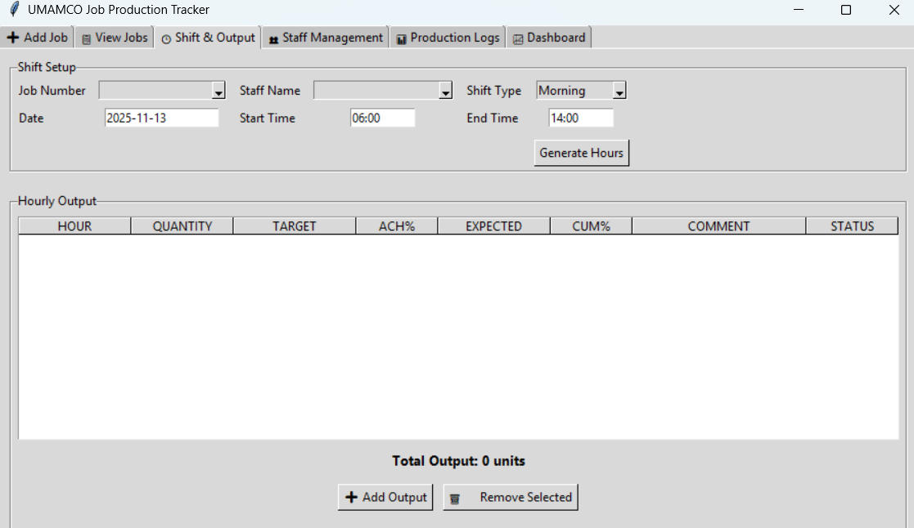
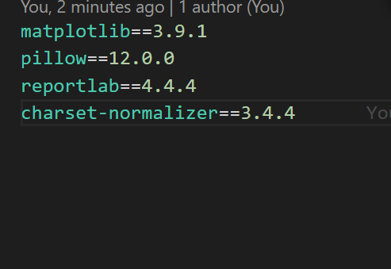

# 📦 UMAMCO Job Production Tracker  
A modular desktop application built with **Python** and **Tkinter** to help production teams track jobs, staff activity, hourly output, and performance analytics.  
This is the **public test build**, prepared with *empty data files* so each user can start fresh with their own entries.

---

## 🚀 Features

### **1. Job Management**
- Add new production jobs  
- Store customer details, product type, and stock requirements  
- Prevent duplicate job numbers  

### **2. Staff Management**
- Add, activate, or deactivate staff members  
- Staff list automatically refreshes across all tabs  

### **3. Shift & Output Tracking**
- Create production shifts  
- Auto-generate hourly targets  
- Enter actual hourly output and performance reasons  
- Visual performance indicators (Red, Yellow, Green, Blue)  
- Save full shift records to JSON  

### **4. Production Logs**
- Track job history and activities  
- Filter logs by job or staff  
- Auto-refreshing log view  

### **5. Analytics Dashboard**
- Displays output performance  
- Job counts & staff statistics  
- Graphs powered by Matplotlib  

---

## 📁 Project Structure
```
job_production_tracker/
│
├── main.py                     # Entry point of the application
├── main_window.py              # Main Tkinter window + tab controller
│
├── ui/                         # All user interface modules
│   ├── tab_add_job.py
│   ├── tab_view_jobs.py
│   ├── tab_shift.py
│   ├── tab_staff.py
│   ├── tab_logs.py
│   └── tab_dashboard.py
│
├── domain/                     # Dataclasses (application models)
│   └── models.py
│
├── storage/                    # Data access layer
│   └── json_store.py
│
├── data/                       # JSON data files (start empty)
│   ├── jobs.json
│   ├── staff.json
│   ├── shift_output.json
│   └── production.json
│
├── screenshots/                # App images used in README
│   ├── add_job.png
│   ├── view_jobs.png
│   ├── staff.png
│   ├── shift.png
│   ├── logs.png
│   └── dashboard.png
│
└── reset_data.py               # Wipes all JSON files (with confirmation)
```
---

## 📘 Note About `production.json`

The file **`production.json`** is included for future enhancements but is **not yet used in Version 1.0**.  
It will normally remain empty.

It is reserved for upcoming features in Version 1.1+, such as:

- Monthly or weekly production summaries  
- Full factory performance analytics  
- Aggregated job lifecycle data  
- High-level KPI tracking  
- Advanced reporting modules

Including this file now ensures smooth forward-compatibility when new features are added.

---

## 📸 Screenshots

### **➕ Add Job**


### **📋 View Jobs**


### **👥 Staff Management**


### **🕒 Shift & Output**


### **📊 Production Logs**


### **⚠️ Production Logs/Erase Button


### **📈 Dashboard**


### ** Dashboard Data Requirements **


---

## ⚙️ Installation & Running the App

### **1. Clone the Repository**
```bash
git clone https://github.com/Umamco/job_production_tracker.git
cd job_production_tracker
```

### **2. Create and Activate a Virtual Environment**
```bash
python -m venv venv
venv\Scripts\activate
```

### **3. Install Dependencies**
```bash
pip install -r requirements.txt
```

### **4. Run the Application**
```bash
python main.py
```
